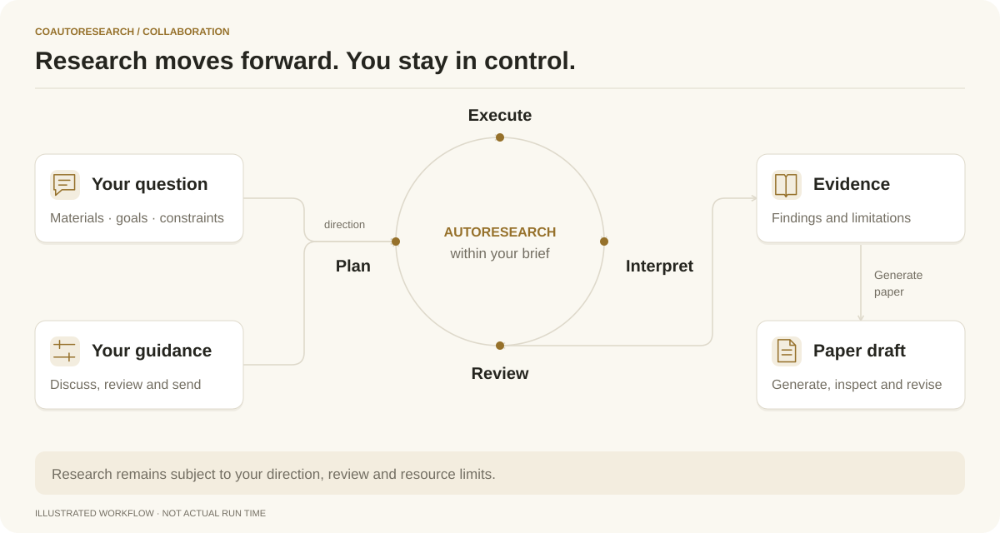
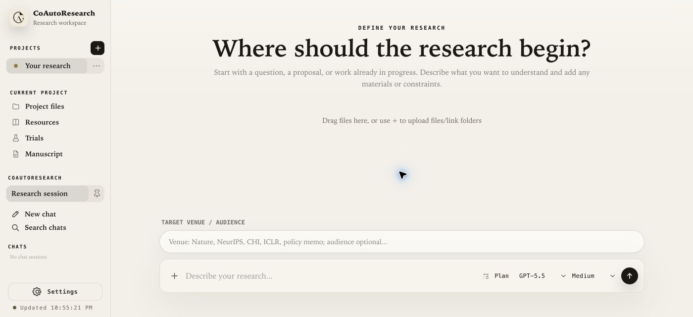
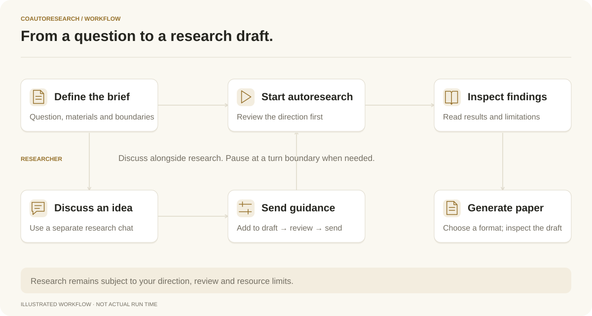

<p align="center">
  <picture>
    <source media="(prefers-color-scheme: dark)" srcset="assets/logo.svg">
    
  </picture>
</p>

<h1 align="center">CoAutoResearch</h1>

<p align="center"><strong>An autonomous research partner you can question, guide, and build with.</strong></p>

CoAutoResearch brings autonomous investigation and human–AI collaboration into one research workflow. Define a question, discuss emerging findings, guide the next step, and build a manuscript from evidence you can trace.

<p align="center">
  <a href="#quick-start">Quick start</a> ·
  <a href="#how-it-works">How it works</a> ·
  <a href="https://yihongt.github.io/CoAutoResearch/walkthrough.html">Walkthrough</a> ·
  <a href="https://yihongt.github.io/CoAutoResearch/index.html">Documentation</a>
</p>

<p align="center">
  <a href="LICENSE"></a>
  <a href="https://yihongt.github.io/CoAutoResearch/index.html"></a>
</p>

## News

- **2026-09-07** — The 2.0 source update brings parallel research discussion, clearer research controls, and in-product paper generation. See the [changelog](CHANGELOG.md) and [GitHub Releases](https://github.com/YihongT/CoAutoResearch/releases) for versioned downloads.

## Co + Auto

**Co — Research together.** Ask why a result looks convincing, discuss an alternative, or prepare a change in direction. Send the suggestions you choose into the research session.

**Auto — Keep research moving.** Let the agent plan, execute, interpret and review bounded research steps within your question and constraints. Pause to reconsider, then continue with new guidance.

**Research — Build on evidence.** Keep proposals, observations, reviewed results and limitations distinct. Follow how the research changes, and carry its supporting evidence into the manuscript.

<picture>
  <source media="(prefers-color-scheme: dark)" srcset="assets/co-auto-dark.svg">
  
</picture>

Discussion does not silently change a project. **Add to research draft** prepares a suggestion; you review it and send it to guide the main research. The shared record preserves what was tried, what was learned and what remains uncertain.

## What you can do

- **Start with a question.** Describe what you want to understand, attach relevant material and set practical limits before starting research.
- **Continue existing work.** Bring a proposal, code, notes or prior results. The agent inspects their context before building on them.
- **Discuss while research runs.** Use a separate chat to examine findings and prepare suggestions alongside the autonomous session.
- **Guide the next iteration.** Review a plan, send an instruction, request a pause or resume with a different emphasis.
- **Inspect the evidence.** Read trials, reviews, resource records and limitations behind the current conclusions.
- **Build a paper.** Generate an evidence-grounded draft, figures, references and PDF from the product, then inspect its review notes.



## Quick start

Give your coding agent one instruction:

> Set up and launch CoAutoResearch from https://github.com/YihongT/CoAutoResearch. Follow docs/agent-setup.md, reuse my existing coding-agent login, configure paper generation, verify the setup, and open the dashboard.

The [setup contract](https://yihongt.github.io/CoAutoResearch/agent-setup.html) checks the environment, reuses your existing Codex or Claude Code authentication, prepares paper tools and verifies the dashboard. Complete any interactive provider login yourself. Dashboard readiness and PDF-tool readiness are reported separately; installation time depends on the dependencies already available.

<details>
<summary>Manual setup from source</summary>

You need Node.js 20+, Python 3.10+, Git and an authenticated Codex or Claude Code CLI.

```bash
git clone https://github.com/YihongT/CoAutoResearch.git
cd CoAutoResearch
node bin/auto-research.js doctor
node bin/auto-research.js ui
```

Open the printed URL and keep the server terminal running. The dashboard has no application dependencies or build step. Choose `--projects-dir /path/to/projects` for a different research folder.

For PDF generation, follow [paper-tool setup](https://yihongt.github.io/CoAutoResearch/paper-generation.html): it additionally prepares Python 3.12+, four pinned scientific skills, LaTeX and Poppler. Research projects can have their own scientific dependencies. Compare the npm version with the checkout before choosing an installation source.

</details>

Create a project, send a research brief and review the proposed direction. Choose **Start autoresearch** when you are ready. Creating a project alone does not start research. See [Getting started](https://yihongt.github.io/CoAutoResearch/getting-started.html) for the complete first-run guide.

## A research walkthrough

<picture>
  <source media="(prefers-color-scheme: dark)" srcset="docs/_static/diagrams/workflow-dark.svg">
  
</picture>

Define a question and practical limits, review the prepared brief, then start research. Use a separate chat to discuss emerging findings while the agent works.

Choose **Add to research draft** when a discussion produces a useful suggestion. Review the wording and send it. At the next applicable boundary, inspect how the research addresses it. Request a pause to reconsider the direction, or resume with a precise instruction.

The [workflow walkthrough](https://yihongt.github.io/CoAutoResearch/walkthrough.html) follows these controls through to reviewing evidence and generating a paper. It explains what each action does without claiming a particular research outcome.

## From findings to a paper

**Manuscript** brings the evolving research story together with its evidence and gaps. Once reviewed results are recorded and project agents are idle, choose **Generate paper**. Specify a venue and year, or request a general research report, then review the model settings.

The internal agent uses four scientific skills for writing, visualization, citations and venue templates. It works from a frozen evidence snapshot, creates figures from saved results and compiles a PDF. It does not run new experiments during writing.

Follow progress, cancel if needed, and open **Paper** when the draft is ready. Preview its pages, download the PDF and source, and inspect review notes. A previous draft remains available if a replacement fails. A compiled PDF still needs human review of claims, references, authorship and submission requirements. [Paper generation details →](https://yihongt.github.io/CoAutoResearch/paper-generation.html)

## How it works

Each **Trial** is a focused research iteration. The agent prepares a bounded plan, performs the work, interprets the evidence and submits the result to the applicable checks. The service records accepted changes and determines whether to continue, pause or request a human decision.

The research record connects directions, resources, results, reviews and manuscript content. Technical contracts distinguish proposed work from recorded changes and support recovery after interruptions. An internal review is a workflow check, not external peer review or proof of scientific correctness. [Architecture and lifecycle →](https://yihongt.github.io/CoAutoResearch/conceptual-framework.html)

## Practical questions

**Can I use my existing coding-agent login?** Yes. Reuse an authenticated Codex or Claude Code CLI. Available models, usage limits and billing depend on your provider account; model discovery in Settings shows what the selected backend exposes.

**Where does my research go?** Project files remain in your chosen local or server folder. The configured model provider processes the context sent to it. External resource lookup can use the network. Review sensitive material before attaching it. This release targets one trusted researcher, not public multi-user hosting.

**Can I pause and come back?** Request **Pause after current turn**, wait for **Paused**, then use **Resume autoresearch**. Closing a browser tab does not stop a running server. Server interruptions may require explicit recovery. [Control semantics →](https://yihongt.github.io/CoAutoResearch/getting-started.html#pause-continue-or-start-over)

**What remains my responsibility?** Choosing the question, evaluating scientific claims, resolving decisions that require human judgment and reviewing anything you share or submit. [Research practices →](https://yihongt.github.io/CoAutoResearch/best-practices.html)

## Documentation and community

[Setup](https://yihongt.github.io/CoAutoResearch/agent-setup.html) · [CLI](https://yihongt.github.io/CoAutoResearch/cli.html) · [Remote access](https://yihongt.github.io/CoAutoResearch/remote-server.html) · [Platforms](https://yihongt.github.io/CoAutoResearch/platforms.html) · [Upgrades](https://yihongt.github.io/CoAutoResearch/upgrading.html)

Report reproducible problems through [Issues](https://github.com/YihongT/CoAutoResearch/issues). See [Contributing](CONTRIBUTING.md), the [Code of conduct](CODE_OF_CONDUCT.md) and [Security](SECURITY.md) for contribution and private vulnerability-reporting guidance.

If CoAutoResearch contributes to your research, cite the software and record the version used:

```bibtex
@software{coautoresearch,
  title = {CoAutoResearch},
  author = {CoAutoResearch contributors},
  url = {https://github.com/YihongT/CoAutoResearch}
}
```

Licensed under [Apache 2.0](LICENSE). Upstream tools and scientific skills retain their respective licenses and attribution requirements.
