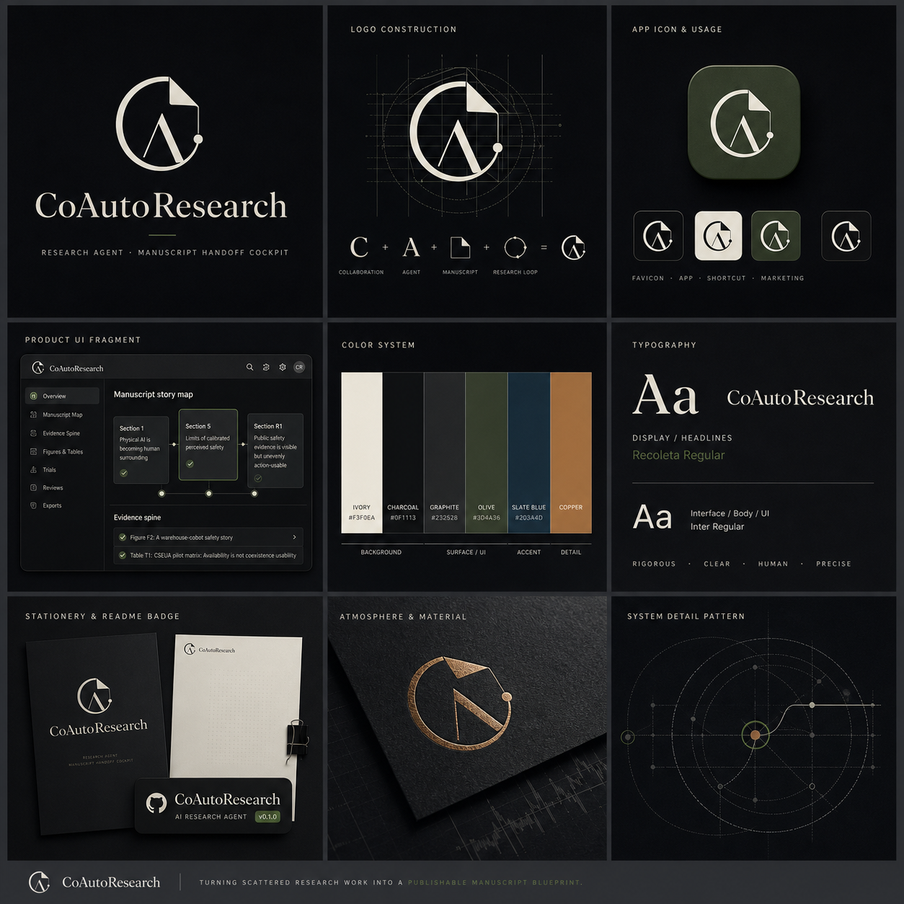

<div align="center">


**A self-improving autonomous research partner you stay in control of.**

An open-source research agent that works *with* you and sharpens its own work
trial by trial — planning the next step, running it, reviewing it against
reviewer gates, and revising until it holds up — while you stay able to
understand, steer, and defend the project at every step.

[](https://www.npmjs.com/package/co-auto-research)
[](LICENSE)
[](https://yihongt.github.io/CoAutoResearch/)

</div>



<div align="center"><sub>Premium brand system with matching Ivory and Nocturne app treatments.</sub></div>

Most "auto research" tools optimize for autonomous output: generate ideas, run
experiments, write a paper, done. CoAutoResearch optimizes for **research
ownership** — the result isn't a finished artifact you can't explain, it's a
traceable research trajectory you can actually use, revise, and defend.

<details>
<summary><strong>What's new</strong></summary>

- **0.1.1** — Default dashboard project folder is now `co-autoresearch-projects/` (legacy `local-projects/` still discovered).
- **0.1.0** — Initial release: immutable project template; `co-auto-research` CLI (`init` / `ui` / `doctor` / `ls` / `attach`); remote-server tunneling; product-docs site.

Full history in [CHANGELOG.md](CHANGELOG.md).

</details>

## Quick start

From any folder, run the published CLI without installing it:

```bash
npx --yes co-auto-research ui
```

No repository clone is needed for this path. It downloads the CLI if needed,
starts a local dashboard, and opens it in your browser. If you run the same
`npx` command from inside a cloned CoAutoResearch checkout, npm resolves that
local checkout instead.

Click **+** in the sidebar to create a project, then describe where your research
should begin. Attach local files with the composer `+` button — they're copied
into your project's `resources/user_input/attachments/` so the agent can cite
them later.

On first launch, the dashboard checks Codex and Claude Code readiness before it
opens project creation. You can still create a project before runtime setup is
complete; agent runs are blocked until one selected backend is ready.

Bringing a proposal, a deep-research report, or a half-finished project? See
[Best practices](docs/best-practices.md) for the recommended ways to start — and
how to turn the blueprint into a finished paper.

You'll need **Node 18+** and one agent CLI — **Codex** (default) or **Claude
Code**. Each backend can use its normal CLI login, or a provider API key saved in
the UI Settings. The few-minute setup is in
[Getting started](docs/getting-started.md).

For repeated use, install it once:

```bash
npm install -g co-auto-research
co-auto-research ui
```

Update anytime with `npm install -g co-auto-research@latest`.

Closed the terminal? Reopen any project from the same folder:

```bash
co-auto-research ls
co-auto-research attach my-project
```

On a remote server, `co-auto-research ui --remote` uses `cloudflared` to print
a temporary Cloudflare browser link, so you can open the UI without SSH port
forwarding. If `cloudflared` is not installed yet, the CLI prints a short
Cloudflare CLI setup guide with install, run, and check commands — see
[Remote servers](docs/remote-server.md). On Linux servers that require an
HTTP proxy for internet access, the same command can automatically route
`cloudflared` through `graftcp`; if the helper is missing, the CLI prints the
one-command `install-graftcp` setup step.

## Why it's different

- **You're the PI.** Step in anytime to change direction, scope, methods,
  claims, or venue — and your decisions become part of the project record.
- **Progress you can follow.** The agent picks one next objective, plans it,
  runs it, and reports — no hidden search tree to reverse-engineer.
- **Every claim is traceable.** Findings, evidence, limitations, and rejected
  paths are kept separate, not buried in chat logs or generated prose.
- **Built for revision.** Answer reviewers, defend assumptions, and keep the
  project moving after the AI hands off.
- **Your work stays yours.** Each project is an independent copy; the reusable
  template is never touched during normal work.

## What a project looks like

Generated projects keep the pieces that make research usable, separate and legible:

- **`PROJECT.md`** — your canonical research direction.
- **`research_trajectory/`** — current state, findings, and a trial-by-trial audit trail.
- **`resources/`** — papers, data, prior work, and target-venue materials.
- **`workspace/`** — the live workbench for concrete implementations, analyses, prototypes, outputs, and other inspectable work products.
- **`manuscript/`** — blueprint, figure specs, reviews, and deliverables.

## Documentation

- [Getting started](docs/getting-started.md) — install, prerequisites, first project
- [Concepts](docs/conceptual-framework.md) — how the research loop works
- [Best practices](docs/best-practices.md) — how to start well, and turn the blueprint into a paper
- [Brand identity](docs/brand.md) — logo meaning and usage notes
- [CLI reference](docs/cli.md) — every command and flag
- [Multiple projects](docs/multiple-projects.md) · [Remote servers](docs/remote-server.md) · [Platform support](docs/platforms.md) · [Upgrading projects](docs/upgrading.md)

## Contributing

Contributions are welcome — see [CONTRIBUTING.md](CONTRIBUTING.md), which also
covers running from a source checkout.

## Citation

If you use CoAutoResearch in your research, please cite it:

```bibtex
@software{coautoresearch2026,
  title        = {CoAutoResearch: A self-improving autonomous research partner you stay in control of},
  author       = {Tang, Yihong},
  year         = {2026},
  howpublished = {\url{https://github.com/YihongT/CoAutoResearch}}
}
```

## License & contact

Released under the [Apache-2.0](LICENSE) license.
Questions, feedback, or collaboration: <yihong.tang.edu@gmail.com>
