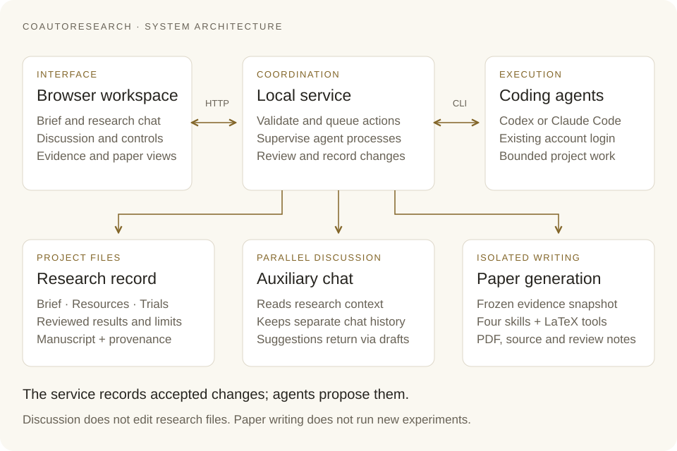

<p align="center">
  <picture>
    <source media="(prefers-color-scheme: dark)" srcset="assets/logo.svg">
    
  </picture>
</p>

<h1 align="center">CoAutoResearch</h1>

<p align="center"><strong>An autonomous research partner you can question, guide, and build with.</strong><br>能够自主推进，也能与你讨论、接受指导、共同积累成果的研究伙伴。</p>

CoAutoResearch 将自主研究与人机协作融入同一工作流。从定义问题、讨论新发现、指导下一步，到基于可追溯的证据逐步形成研究稿。

<p align="center">
  <a href="README.md">English</a> · <strong>简体中文</strong>
</p>

<p align="center">
  <a href="#快速开始">快速开始</a> ·
  <a href="#功能特点">功能特点</a> ·
  <a href="#示例论文">示例论文</a> ·
  <a href="https://yihongt.github.io/CoAutoResearch/">文档</a>
</p>

<p align="center">
  <a href="LICENSE"></a>
  <a href="https://yihongt.github.io/CoAutoResearch/"></a>
</p>


*Digits 示例的研究发现、证据与局限，截取自实际网页工作区。*

## 最新动态

- **2026-09-09** — 新增 [Digits 和 Ising 示例论文](#示例论文)，改进研究恢复流程与论文生成检查。
- **2026-09-07** — 2.0 源码更新加入并行研究讨论、更清晰的研究控制和产品内论文生成。

[更新记录](CHANGELOG.md) · [已发布版本](https://github.com/YihongT/CoAutoResearch/releases)

## 功能特点

**讨论与指导。** 质疑一个发现，在并行聊天中讨论其他方案，再将你选定的建议发送到主研究会话。

**自主研究。** Agent 根据研究要求规划、执行、解释和审查每轮工作。你可以查看进展，暂停思考，再继续研究。

**证据追溯。** 随着研究推进，清楚区分提议、观察、经过检查的结果和局限。

<picture>
  <source media="(prefers-reduced-motion: reduce) and (prefers-color-scheme: dark)" srcset="assets/co-auto-dark.svg">
  <source media="(prefers-reduced-motion: reduce)" srcset="assets/co-auto-light.svg">
  <source media="(prefers-color-scheme: dark)" srcset="assets/co-auto-dark.gif">
  
</picture>

流程示意动画，不代表实际运行速度。[静态图](assets/co-auto-light.svg) · [深色版本](assets/co-auto-dark.svg)

在开源的网页工作区中，使用你已有的 **Codex 或 Claude Code** 登录。从一个问题、提案或已有工作开始，将研究方向、讨论、证据和写作保留在同一项目中。

## 快速开始

把下面这句话交给你的 coding agent：

```text
Set up and launch CoAutoResearch from
https://github.com/YihongT/CoAutoResearch.
Follow docs/agent-setup.md, reuse my existing coding-agent login,
configure paper generation, verify the setup, and open the dashboard.
```

安装过程复用你的 **Codex 或 Claude Code** 登录，并分别检查网页工作区和论文工具是否就绪。需要交互登录时由你本人完成。可用模型与用量限制取决于你的账户；具体研究可能还需要安装相应的科学计算依赖。

<details>
<summary>从源码手动启动</summary>

需要 Node.js 20+、Python 3.10+、Git，以及已安装并登录的 Codex 或 Claude Code CLI。

```bash
git clone https://github.com/YihongT/CoAutoResearch.git
cd CoAutoResearch
node bin/auto-research.js doctor
node bin/auto-research.js ui
```

打开终端输出的网址，并保持服务终端运行。网页工作区无需额外安装应用依赖或执行构建。使用 `--projects-dir /path/to/projects` 指定研究项目存放位置。

生成 PDF 另外需要 Python 3.12+、四个固定版本的科学写作 skill、LaTeX 和 Poppler。安装和检查步骤见 [Agent 配置指南](docs/agent-setup.md)。无需等待 npm 发布即可从源码使用。

</details>

首次使用：**创建项目 → 发送研究要求 → 检查研究方向 → Start autoresearch**。说明你的问题、已有材料、资源预算，以及哪些决定需要你批准。创建项目本身不会启动研究。

[首次使用指南 →](https://yihongt.github.io/CoAutoResearch/getting-started.html)

界面和详细文档目前为英文；agent 面向你的交流跟随你的语言。本页保留英文按钮名，便于对照操作。

## 工作原理

每个 **Trial** 是一次围绕具体问题的研究迭代：规划工作、执行、解释证据，然后提交相应检查。服务记录被接纳的修改，并判断接下来继续、暂停，还是等待人的决定。

研究运行时，你可以在并行聊天中讨论发现。**Add to research draft** 将建议放入主研究草稿；当你希望它指导研究时，先审阅，再发送。仅仅聊天不会修改研究文件。

**Pause after current turn** 请求在 agent 当前 turn 结束后暂停，此时一个 Trial 可能尚未完成。**Resume autoresearch** 从保留的状态继续。你可以在 **Manuscript** 中查看已记录结果和待解决问题。

[研究控制与工作流 →](https://yihongt.github.io/CoAutoResearch/walkthrough.html)

<details>
<summary>了解系统架构</summary>

<picture>
  <source media="(prefers-color-scheme: dark)" srcset="docs/_static/diagrams/architecture-dark.svg">
  
</picture>

研究记录连接方向、资源、结果、审查和研究稿。技术契约区分拟议工作与已记录修改，并支持中断恢复。内部审查属于工作流检查，不等于外部同行评审，也不能证明科学结论正确。

[架构与生命周期](https://yihongt.github.io/CoAutoResearch/conceptual-framework.html)

</details>

## 示例论文

两篇通过网页端、基于项目已记录证据生成的研究草稿。

<table>
  <tr>
    <td width="50%" valign="top">
      <a href="docs/_static/examples/digits-paper.pdf"></a>
      <p><strong>Digits · 统计学习</strong></p>
      <p>用于小样本手写数字分类的协方差收缩。</p>
    </td>
    <td width="50%" valign="top">
      <a href="docs/_static/examples/ising-paper.pdf"></a>
      <p><strong>Ising · 统计物理</strong></p>
      <p>CPU 预算约束下的临界温度估计与实现诊断。</p>
    </td>
  </tr>
  <tr>
    <td><a href="docs/_static/examples/digits-paper.pdf"><strong>阅读论文 · 11 页</strong></a></td>
    <td><a href="docs/_static/examples/ising-paper.pdf"><strong>阅读论文 · 10 页</strong></a></td>
  </tr>
</table>

这些论文来自开发者操作的产品验收，过程中包含人工介入。研究草稿保留了自身局限，正式发表前仍需人工科学审阅。[关于这两篇论文 →](https://yihongt.github.io/CoAutoResearch/example-papers.html)

**从你的研究发现到论文。** 当经过审查的结果已记录、项目 agent 均空闲时，选择 **Generate paper**，指定一般报告或目标期刊／会议，并检查写作模型。内部 agent 使用科学写作、可视化、引用管理和投稿模板四个 skill，从冻结的证据快照生成论文，不运行新实验。

打开 **Paper** 即可缩放、连续滚动，并下载 PDF 与源文件。生成新版本期间仍可查看旧稿。[论文配置与生成 →](https://yihongt.github.io/CoAutoResearch/paper-generation.html)

## 文档

| 开始使用 | 理解与扩展 |
|---|---|
| [配置](https://yihongt.github.io/CoAutoResearch/agent-setup.html) · [工作流](https://yihongt.github.io/CoAutoResearch/walkthrough.html) | [架构](https://yihongt.github.io/CoAutoResearch/conceptual-framework.html) · [CLI](https://yihongt.github.io/CoAutoResearch/cli.html) |
| [论文生成](https://yihongt.github.io/CoAutoResearch/paper-generation.html) · [FAQ](https://yihongt.github.io/CoAutoResearch/faq.html) | [平台支持](https://yihongt.github.io/CoAutoResearch/platforms.html) · [远程使用](https://yihongt.github.io/CoAutoResearch/remote-server.html) · [升级](https://yihongt.github.io/CoAutoResearch/upgrading.html) |

## 社区

欢迎通过 [Issues](https://github.com/YihongT/CoAutoResearch/issues) 提交可复现的问题和功能建议，也欢迎改进产品、文档或贡献记录清晰的研究示例。请阅读 [贡献指南](CONTRIBUTING.md)、[行为准则](CODE_OF_CONDUCT.md) 和 [安全反馈](SECURITY.md)。

<details>
<summary>引用 CoAutoResearch</summary>

如果在研究中使用 CoAutoResearch，请引用本软件，并记录实际使用的版本或提交。

```bibtex
@software{coautoresearch,
  title = {CoAutoResearch},
  author = {CoAutoResearch contributors},
  url = {https://github.com/YihongT/CoAutoResearch}
}
```

</details>

本项目使用 [Apache 2.0](LICENSE) 许可证。上游工具与 skill 保留各自的许可证和署名要求。

Contact: [yihong.tang@mail.mcgill.ca](mailto:yihong.tang@mail.mcgill.ca)
