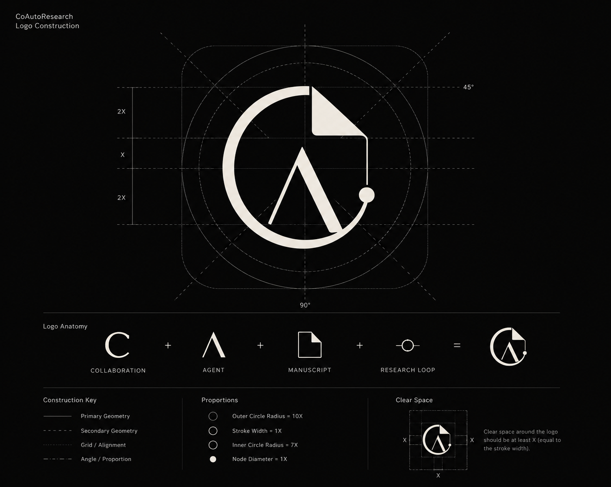

# Brand Identity

CoAutoResearch uses a research-loop manuscript mark. It is meant to feel like a
premium research workspace rather than a generic AI assistant.

## Logo idea

The mark combines three product ideas:

- a research loop for iterative trials and review gates;
- a manuscript page for the blueprint handoff;
- a compact A-shaped spine for the autonomous research agent.

The circular field keeps the mark usable as a favicon, app icon, package badge,
and README symbol. The approved brand direction is intentionally narrow: Ivory
and Nocturne surfaces, with the manuscript mark reproduced from the provided
brand artwork instead of being reinterpreted into extra product palettes.

## Logo construction

The construction board documents the approved geometry, logo anatomy, clear
space, and proportion rules. It belongs in brand documentation rather than the
operational dashboard, where the mark should stay compact and functional.

## Assets

- `assets/logo.png` is the approved public repository lockup.
- `assets/logo.svg` is the icon-only SVG fallback for documentation contexts.
- `templates/default/ui/assets/brand/brand-mark-nocturne.png` is the Nocturne sidebar mark.
- `templates/default/ui/assets/brand/brand-mark-ivory.png` is the Ivory sidebar mark.
- The dashboard sidebar pairs those theme-specific marks with a live-text `CoAutoResearch` wordmark.
- `templates/default/ui/assets/brand/sidebar-logo.png` is the Nocturne wordmark reference.
- `templates/default/ui/assets/brand/favicon.svg` is the dashboard favicon.
- `templates/default/ui/assets/brand/logo-light.png` is the PNG fallback for
  the Ivory theme and other light surfaces.
- `templates/default/ui/assets/brand/logo-dark.png` is the PNG fallback for
  the Nocturne theme and other dark surfaces.
- `templates/default/ui/index.html` uses the approved sidebar lockup in the
  local dashboard shell.
- `assets/hero.png` is the approved README and documentation brand board. It
  shows the logo construction, app icon usage, color system, typography, and
  product UI fragment in the premium dark visual direction.

## Theme coverage

The dashboard Settings panel exposes two first-class themes, and the PR ships
matching icon assets for both:

- **Ivory**: the white-paper workspace. Use the light-surface brand asset:
  ivory field with the dark manuscript mark.
- **Nocturne**: the black reading workspace. Use the dark-surface brand asset:
  Nocturne field with the ivory manuscript mark.

The sidebar lockup uses the approved artwork crop. Favicons and app icons remain
containerized so browser chrome, shortcuts, and package previews do not depend
on the active dashboard theme.

## Usage notes

- Prefer the SVG mark where possible.
- Use `logo-light.png` on Ivory or white surfaces and `logo-dark.png` on
  Nocturne or black surfaces.
- Do not recolor the mark or introduce additional product palettes.
- Do not add robot, brain, sparkle, or magic-wand symbols near the logo.
- If a wordmark is needed, pair the mark with the plain text name
  `CoAutoResearch` rather than baking text into the icon.
