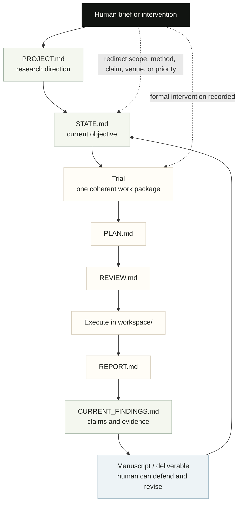

# Conceptual Framework

CoAutoResearch is a human-centered research loop. The agent can do substantial
work, but the human remains responsible for direction, claims, evidence, and
revision.

## What The Diagram Means

- The loop is linear enough for a human to follow.
- Every substantive work package gets a plan and report.
- Claims become current only when reflected in findings and evidence records.
- Human intervention is not an afterthought; it is part of the control system.
- The output should be something the human can understand, defend, and revise.
