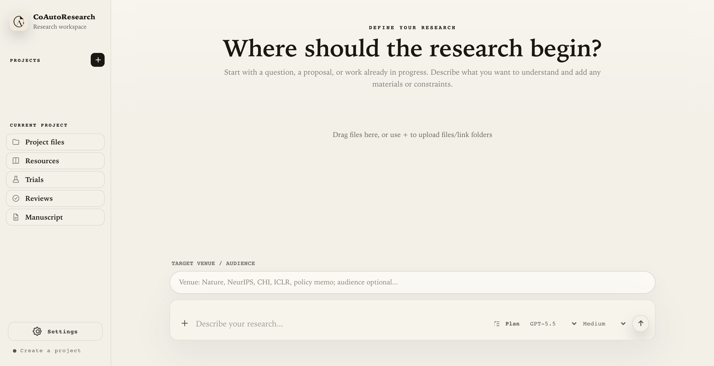
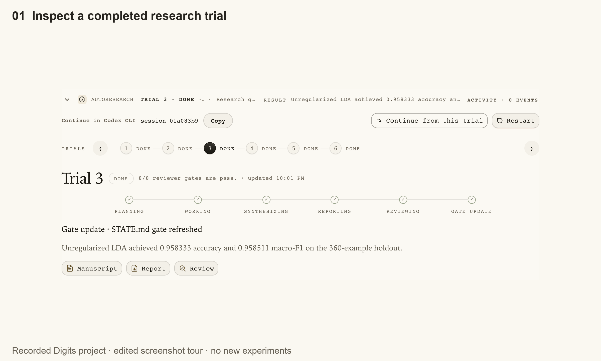
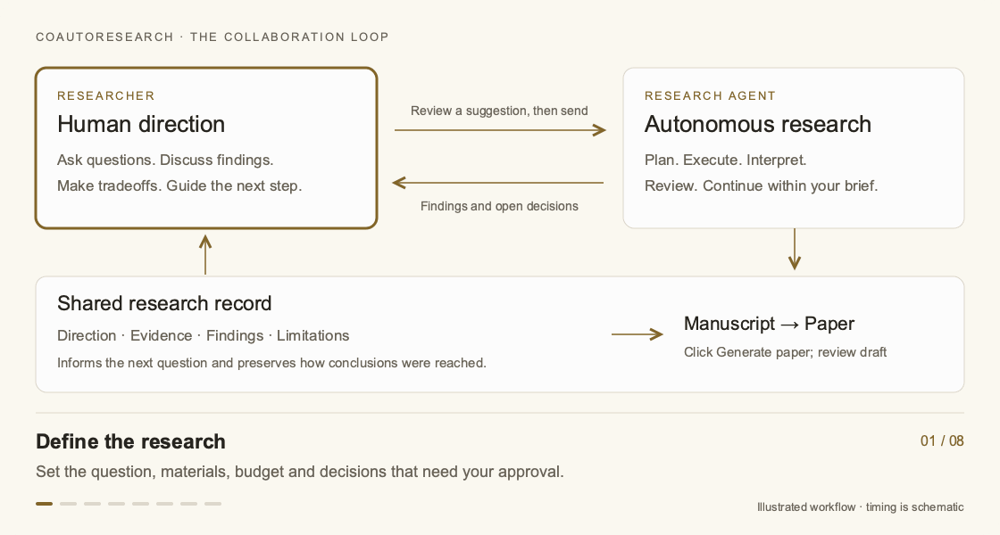
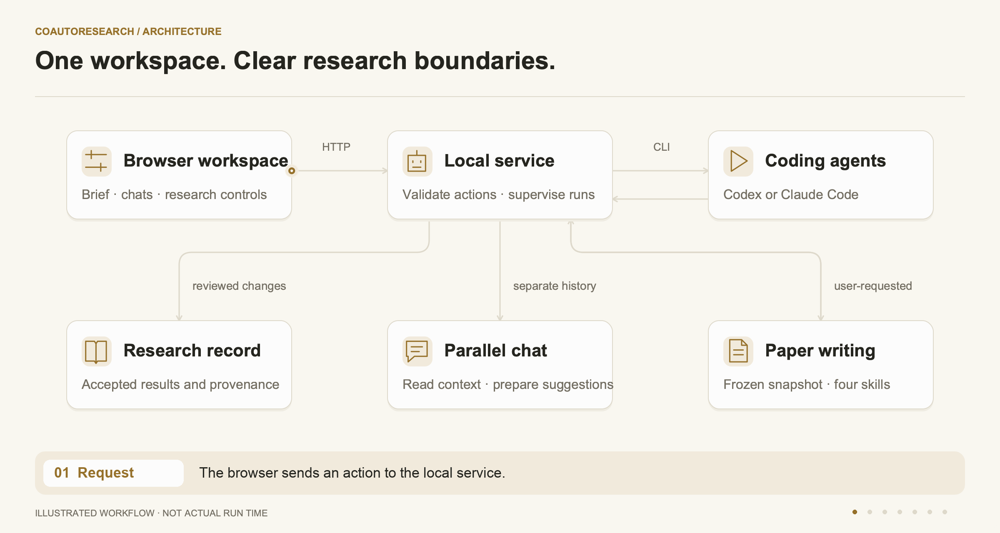
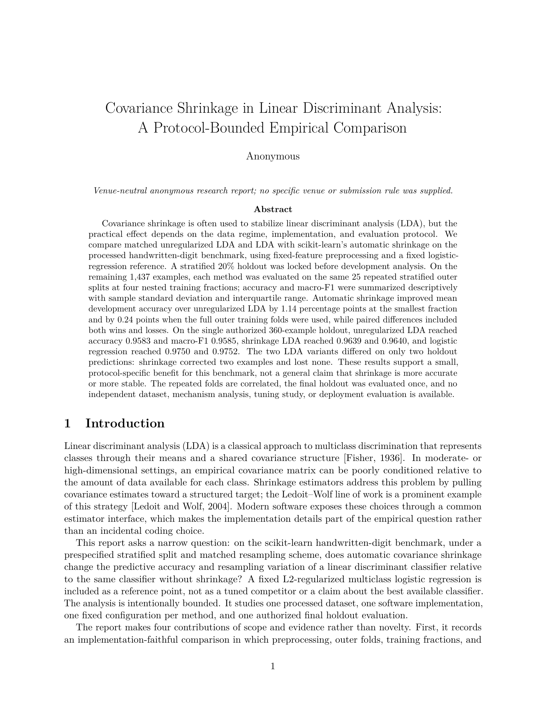
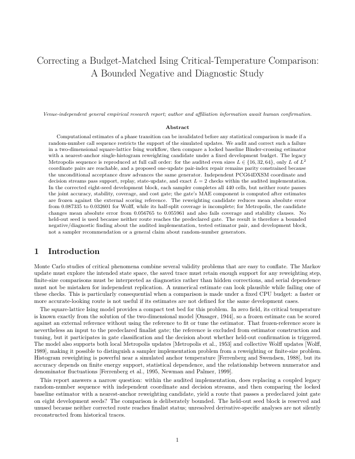

<!-- Translation basis is tracked in readme/translations.json. -->
<p align="center"><picture>
  <source media="(prefers-color-scheme: dark)" srcset="../assets/readme-hero-dark.svg">
  
</picture></p>

<p align="center"><strong>An autonomous research partner that self-improves recursively and works with you.</strong></p>

<p align="center">Define una pregunta. Experimenta. Discute los hallazgos. Mejora el siguiente paso.<br>Elabora un manuscrito y un borrador de artículo con evidencias trazables.</p>

<p align="center"><a href="#quick-start"><strong>Inicio rápido →</strong></a> · <a href="#features">Funciones</a> · <a href="#example-papers">Artículos de ejemplo</a> · <a href="https://yihongt.github.io/CoAutoResearch/">Documentación</a></p>



*Empieza con una pregunta, una propuesta o un trabajo en curso.*

<details>
<summary>🌐 Languages</summary>

<p align="center"><a href="../README.md">English</a> · <a href="README.zh-CN.md">简体中文</a> · <a href="README.zh-TW.md">繁體中文</a> · <a href="README.ja.md">日本語</a> · <a href="README.ko.md">한국어</a> · <strong>Español</strong><br><a href="README.pt-BR.md">Português brasileiro</a> · <a href="README.fr.md">Français</a> · <a href="README.de.md">Deutsch</a> · <a href="README.ru.md">Русский</a> · <a href="README.ar.md">العربية</a></p>

<p align="center"><sub>Estas son traducciones del README. La interfaz y la documentación completa están en inglés; el agente responde en tu idioma.</sub></p>

</details>

<p align="center"><a href="../LICENSE"></a> <a href="https://yihongt.github.io/CoAutoResearch/"></a></p>

<a id="news"></a>

## 📰 Novedades

- **2026-09-09** — Se añadieron artículos de ejemplo de Digits e Ising, mejoras de recuperación y comprobaciones más rigurosas al generar artículos.
- **2026-09-07** — La actualización del código 2.0 incorpora debates paralelos, controles más claros y generación de artículos dentro del producto.

[Changelog](../CHANGELOG.md) · [Releases](https://github.com/YihongT/CoAutoResearch/releases)

<a id="features"></a>

## ✨ Funciones

**Debate mientras se investiga.** Explora ideas en un chat independiente. Revisa y envía una sugerencia cuando quieras que oriente la investigación.

**Automejora recursiva.** Incorpora resultados registrados, comentarios de revisión y lecciones reutilizables en el siguiente ensayo. Revisa hipótesis, métodos y decisiones dentro de tus instrucciones y presupuesto; conserva los resultados negativos y concluye cuando la evidencia lo indique.

**Examina la evidencia.** Sigue los hallazgos, las comprobaciones y las limitaciones hasta el manuscrito y el borrador del artículo.

<a href="https://yihongt.github.io/CoAutoResearch/walkthrough.html#screenshots">
<picture>
  <source media="(prefers-reduced-motion: reduce)" srcset="../assets/browser-tour.png">
  
</picture>
</a>

Recorre un proyecto Digits terminado: registros, manuscrito y PDF. Este recorrido de navegador editado y recortado muestra el historial existente, no una nueva ejecución ni la velocidad real de investigación.

<details>
<summary>Tres formas de empezar</summary>

**Una pregunta nueva:** «Compara dos métodos con un pequeño conjunto de datos público. Usa solo CPU, indica el presupuesto y pide confirmación antes de la evaluación final».

**Trabajo existente:** «Lee mi propuesta y los materiales adjuntos. Identifica el siguiente experimento útil y prepara un plan para revisar».

**Un resultado por investigar:** «Comprueba si este hallazgo resiste una comparación más exigente. Conserva los resultados originales e informa de las limitaciones».

</details>

<a id="quick-start"></a>

## 🚀 Inicio rápido

**Agentes de programación compatibles:** ✓ Codex CLI · ✓ Claude Code

Entrega esta instrucción a tu coding agent:

```text
Set up and launch CoAutoResearch from
https://github.com/YihongT/CoAutoResearch.
Follow docs/agent-setup.md, reuse my existing coding-agent login,
configure paper generation, verify the setup, and open the dashboard.
```

La configuración tiene tres puntos de control: **el panel abre → el coding agent está autenticado y listo → las herramientas de artículos están listas**. Completa personalmente el inicio de sesión interactivo. Los modelos y límites dependen de tu cuenta; la investigación puede necesitar dependencias adicionales.

<details>
<summary>Inicio manual desde el código fuente</summary>

Necesitas Node.js 20+, Python 3.10+, Git y una CLI de Codex o Claude Code instalada y autenticada.

```bash
git clone https://github.com/YihongT/CoAutoResearch.git
cd CoAutoResearch
node bin/auto-research.js doctor
node bin/auto-research.js ui
```

Abre la URL indicada y mantén el servidor activo. El panel no necesita dependencias de aplicación ni compilación. Usa `--projects-dir /path/to/projects` para guardar la investigación fuera del repositorio.

La generación de PDF también necesita Python 3.12+, cuatro habilidades científicas con versiones fijadas, LaTeX y Poppler. Sigue la guía agent setup. Puedes usar el código fuente sin una publicación en npm.

[Agent setup](../docs/agent-setup.md)

</details>

Primera sesión: **Create project → enviar las instrucciones de investigación → revisar la dirección → Start autoresearch**. Incluye materiales, presupuesto de cómputo y decisiones que requieren aprobación. Crear un proyecto no inicia la investigación.

[Setup](https://yihongt.github.io/CoAutoResearch/agent-setup.html) · [Walkthrough](https://yihongt.github.io/CoAutoResearch/walkthrough.html)

<a id="how-it-works"></a>

## 🔄 Cómo funciona

Cada **Trial** es una iteración de investigación acotada. El servicio comprueba los cambios propuestos, registra los resultados aceptados y decide si continuar, pausar o solicitar una decisión humana. La revisión interna no es revisión externa por pares ni prueba de una afirmación científica.

**Add to research draft** prepara texto, pero no lo envía ni lo aplica. **Pause after current turn** solicita una pausa al terminar un turno del agente, posiblemente dentro de un Trial. **Resume autoresearch** continúa desde el estado conservado.

<picture>
  <source media="(prefers-reduced-motion: reduce)" srcset="../assets/co-auto-light.svg">
  <source media="(prefers-color-scheme: dark)" srcset="../assets/co-auto-dark.gif">
  
</picture>

Flujo ilustrativo; el tiempo es esquemático. Hay alternativas estáticas. [SVG](../assets/co-auto-light.svg)

<details open>
<summary>🏗️ Explorar la arquitectura del sistema</summary>

<picture>
  <source media="(prefers-reduced-motion: reduce)" srcset="../docs/_static/diagrams/architecture.svg">
  <source media="(prefers-color-scheme: dark)" srcset="../docs/_static/diagrams/architecture-dark.gif">
  
</picture>

[Architecture and lifecycle](https://yihongt.github.io/CoAutoResearch/conceptual-framework.html)

</details>

<a id="example-papers"></a>

## 📄 Artículos de ejemplo

<table>
<tr>
<td width="50%" valign="top"><a href="../docs/_static/examples/digits-paper.pdf"></a><p><strong>¿Puede la contracción de covarianza ayudar a clasificar dígitos manuscritos con pocos datos de entrenamiento?</strong></p><p>Comparaciones emparejadas con muestras pequeñas y una sola evaluación reservada; los hallazgos se limitan a estos datos y protocolo.</p><p><a href="../docs/_static/examples/digits-paper.pdf">Leer artículo · PDF</a></p></td>
<td width="50%" valign="top"><a href="../docs/_static/examples/ising-paper.pdf"></a><p><strong>¿Con qué fiabilidad puede un portátil estimar una transición de fase de Ising?</strong></p><p>Estimación con presupuesto de CPU y diagnóstico de implementación. Las mejoras parciales no cumplieron los criterios conjuntos; las semillas reservadas no se utilizaron.</p><p><a href="../docs/_static/examples/ising-paper.pdf">Leer artículo · PDF</a></p></td>
</tr>
</table>

Ambos artículos son borradores obtenidos en evaluaciones operadas por desarrolladores con intervención humana, no casos de usuarios externos. Conservan sus limitaciones y requieren revisión científica humana antes de publicarse.

Cuando los resultados revisados estén registrados y los agentes estén inactivos, elige **Generate paper**. El agente interno usa habilidades de redacción, visualización, citas y formato de publicación sobre una instantánea congelada de la evidencia, sin nuevos experimentos.

Abre **Paper** para ampliar, desplazarte y descargar el PDF y el código fuente. El borrador anterior sigue disponible mientras se genera su sustituto.

[Artículos de ejemplo](https://yihongt.github.io/CoAutoResearch/example-papers.html) · [Paper generation](https://yihongt.github.io/CoAutoResearch/paper-generation.html)

<a id="documentation"></a>

## 📚 Documentación

Las guías enlazadas están en inglés. Empieza por Setup o Walkthrough; consulta FAQ para dudas frecuentes y Platforms para los límites de compatibilidad.

- [Setup](https://yihongt.github.io/CoAutoResearch/agent-setup.html)
- [Walkthrough](https://yihongt.github.io/CoAutoResearch/walkthrough.html)
- [Paper generation](https://yihongt.github.io/CoAutoResearch/paper-generation.html)
- [FAQ](https://yihongt.github.io/CoAutoResearch/faq.html)
- [Platforms](https://yihongt.github.io/CoAutoResearch/platforms.html)
- [CLI](https://yihongt.github.io/CoAutoResearch/cli.html)
- [Architecture](https://yihongt.github.io/CoAutoResearch/conceptual-framework.html)
- [Upgrades](https://yihongt.github.io/CoAutoResearch/upgrading.html)

<a id="community"></a>

## 🤝 Comunidad

Ayuda a verificar instalaciones, informar de errores reproducibles, mejorar flujos de investigación, mantener traducciones o compartir resultados documentados. Usa Issues y lee la guía de contribución; comunica problemas de seguridad en privado.

[Issues](https://github.com/YihongT/CoAutoResearch/issues) · [Contributing](../CONTRIBUTING.md) · [Translations](../readme/TRANSLATING.md) · [Security](../SECURITY.md) · [Code of conduct](../CODE_OF_CONDUCT.md)

<details>
<summary>Citar CoAutoResearch</summary>

Cita el software y registra la versión o el commit utilizado.

```bibtex
@software{coautoresearch,
  title = {CoAutoResearch},
  author = {CoAutoResearch contributors},
  url = {https://github.com/YihongT/CoAutoResearch}
}
```

</details>

Licencia Apache 2.0. Las herramientas y habilidades de terceros conservan sus licencias y requisitos de atribución.

Contacto: [yihong.tang@mail.mcgill.ca](mailto:yihong.tang@mail.mcgill.ca)
